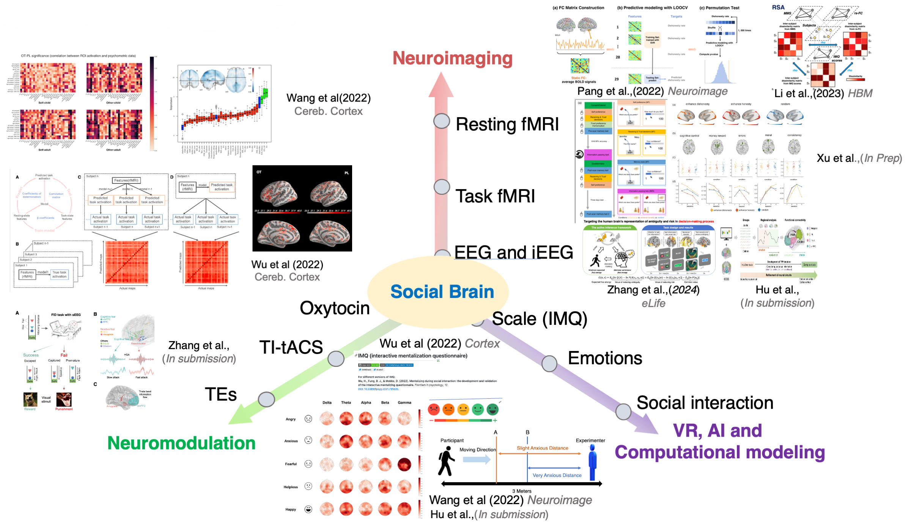

The Affective, Neuroscience, and Decision-making lab is located at the [Centre for Cognitive and Brain Sciences](https://ccbs.ici.um.edu.mo){:target="_blank"} (CCBS) at [University of Macau](https://um.edu.mo){:target="_blank"} (UM), Macau SAR, China.

<!-- Our current **research directions**: -->
## Research Directions

1) *Social cognition and affective neuroscience*: the multi-modal representation of negative emotional experiences (anxiety, fear, helpless) and its neurocomputation; the learning and representation of social information (social distance, emotional variability, affiliation) and its influence on social relationship; the neurocomputation of mentalizing and social decision-making (dishonesty decisions); the effect of pharmaceutical modulation (oxytocin) and neuromodulation (TMS&TDCS) on social cognition and behaviors.

2) *Computational neuroscience*: we mainly leverage Bayesian modeling, Reinforcement learning, Drift-diffusion model to quantify human social learning and adaptive social decision-making.

3) *Artificial intelligence (AI) and Human-AI interaction*: e.g., how AI facilitates empathy and interaction between human-AI and even between human-human, how human perceive and inference the affect of AI.

## News

**2024.3.31** ANDLab held a workshop on *PPT Graphing in Academia* presented by Zhexu. The session covered key tips for creating PowerPoint visuals for academic purposes. Watch the full recording on YouTube: [ANDlab workshop- plotting with PowerPoint](https://youtu.be/7xqX-s8AD2s).

**2024.3.13** ANDLab preprinted an article titled ‘Unethical amnesia brain: Memory and metacognitive distortion induced by dishonesty’. In this article, we investigate the neural and computational mechanisms underlying the metacognition distortion caused by repeated dishonesty.
We find that: 
1) Immediate and delayed metacognition changes manifest on multiple dimensions of response in the pre-and post-scan memory tasks;
2) The compression of representational geometry of reward in OFC was correlated with both immediate and delayed metacognition changes;
3) Functional connectivity (FC) between DLPFC and lTPJ under dishonest responses predicts both immediate and delayed metacognition changes.

These results suggest that decision-making, emotion, and memory-related brain regions together play a key role in metacognition change after immoral action, shedding light on the neural mechanism of the complex interplay between moral decisions, cognitive processes, and memory distortion.

**2024.2.10** ANDLab preprinted a high-density EEG dataset (https://www.biorxiv.org/content/10.1101/2024.02.08.579481v1)
 stimulated by Chinese, 12 hours of reading Chinese, providing 128-channel EEG, preprocessing, source localization, and text embedding of the pre-trained model. Many thanks to our collaborators!!

**2024.1.16** ANDLab preprinted an article titled "An intracranial dissection of human escape circuits". In this preprint, we found the brain regions in the cognitive fear circuit, including the ventromedial prefrontal cortex and hippocampus, encoded the threat level during the information processing stage. The actual escaping stage, especially under rapid attack, prominently activated areas within the reactive fear circuit, including the midcingulate cortex and amygdala. Furthermore, we observed a negative correlation between the high gamma activity (HGA) of the amygdala and the HGA of the vmPFC and HPC under rapid attacks. This indicates that the amygdala may suppress the activity of the cognitive fear circuit under rapid attacks, enabling the organism to react quickly to ensure survival under the imminent threat. @Macau

**2023.10.14** Prof. Wu Haiyan delivered a presentation on the neurolaw research led by Jiamin at the 25th Psychological Academic Conference. @Chengdu
